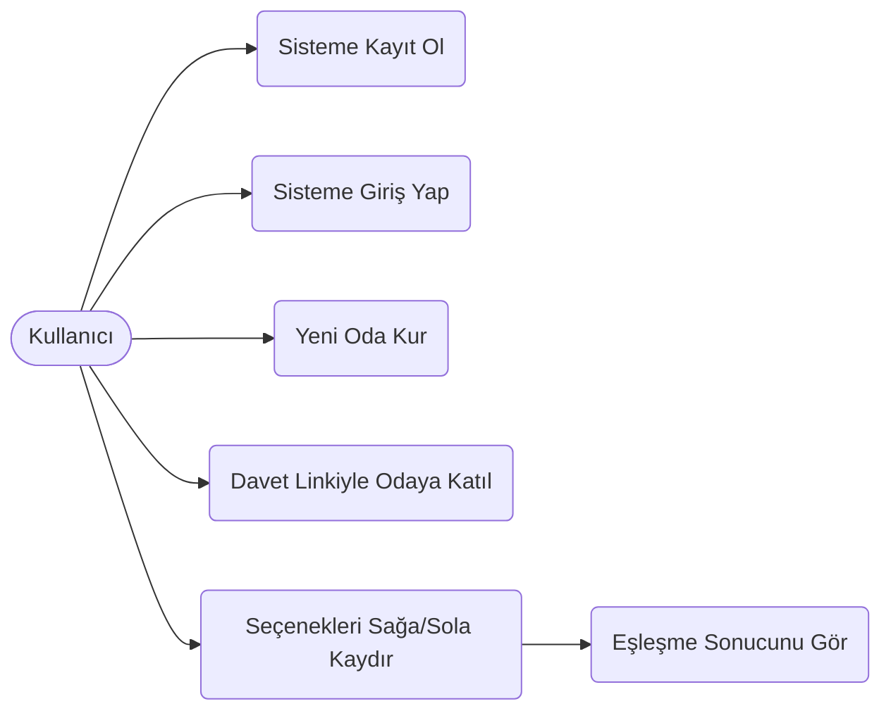
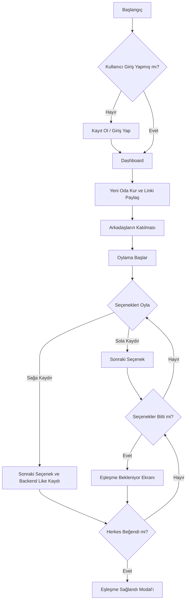
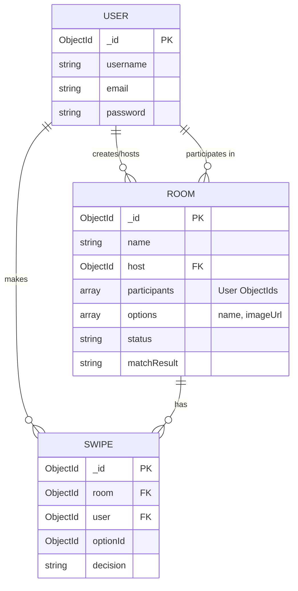

# BiteMatch: Grup Karar Motoru

BiteMatch, 4-5 kişilik bir arkadaş grubuyla buluşulduğunda yaşanan "Ne yiyelim?", "Nereye gidelim?" tartışmalarına son veren, Tinder mantığıyla çalışan bir ortak karar uygulamasıdır.

Bu proje, **BLG330 – Web Programlama Dönem Projesi** kapsamında **MERN Stack** (MongoDB, Express.js, React.js, Node.js) ile geliştirilmiştir.

## 🚀 Kullanılan Teknolojiler

- **Frontend:** React.js, Vite, React Router, Context API, Framer Motion, Vanilla CSS (Dark/Neon temalı gösterişli tasarım)
- **Backend:** Node.js, Express.js, Mongoose, JWT (JSON Web Token), bcryptjs
- **Veritabanı:** MongoDB

## 📦 Kurulum ve Çalıştırma

Proje hem backend hem de frontend içerir. Projeyi ayağa kaldırmak için terminalde şu komutları sırasıyla çalıştırın:

1. **Backend Kurulumu:**
   ```bash
   cd backend
   npm install
   npm run dev
   ```
   *(Not: `backend/.env` dosyasındaki MongoDB URI ayarını kendi Atlas bağlantınızla değiştirebilirsiniz, varsayılan olarak local mongodb kullanılır).*

2. **Frontend Kurulumu:**
   ```bash
   cd frontend
   npm install
   npm run dev
   ```

## 📸 Ekran Görüntüleri

*Not: Proje canlıya alındığında veya teste açıldığında ekran görüntüleri eklenecektir.*
- **Dashboard:** `(Ekran Görüntüsü)`
- **Admin Paneli:** `(Ekran Görüntüsü)`
- **Oda & Oylama Ekranı:** `(Ekran Görüntüsü)`

## 📐 Tasarım ve UML Diyagramları

Projenin tasarım mimarisi ve bileşenleri aşağıdaki UML diyagramlarında gösterilmiştir:

### 1. Use-Case Diyagramı


### 2. Activity Diyagramı


### 3. ER Diyagramı (Entity Relationship)


### 4. Component Diyagramı
```mermaid
graph TD
    subgraph Frontend (React)
        A[App Router] --> B[AuthContext]
        A --> C[RoomContext]
        B --> D(Login/Register Pages)
        C --> E(Dashboard Page)
        C --> F(Room Page)
        F --> G(MatchModal Component)
    end
    
    subgraph Backend (Express + Node)
        H[API Routes] --> I[Auth Controller]
        H --> J[Room Controller]
        H --> K[Swipe Controller]
        I --> L[(MongoDB: Users)]
        J --> M[(MongoDB: Rooms)]
        K --> N[(MongoDB: Swipes)]
    end

    Frontend -- REST API (Axios) --> Backend
```

## 🔥 Teslimat Gereksinimleri Eşleşmesi
- **MERN Stack:** Kullanıldı (MongoDB, Express, React, Node).
- **Backend:** En az 4 Endpoint mevcut (Auth, Room CRUD, Swipe). MVC mimarisi kullanıldı.
- **Frontend:** En az 8 component kullanıldı. State yönetimi (Context API) ve sayfa yönlendirme (React Router) yapıldı.
- **Database:** Mongoose ile 3 schema (User, Room, Swipe) oluşturuldu, ilişkilendirildi.
- **Auth:** JWT ve bcryptjs ile login/register işlemleri protected routing ile kodlandı.
- **Uygulama Kalitesi:** Responsive ve animasyonlu (Framer Motion) şık bir arayüz.
